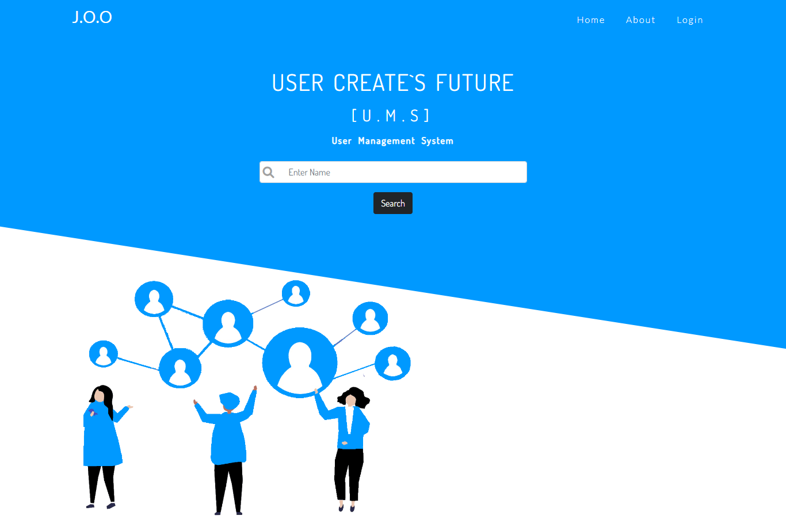
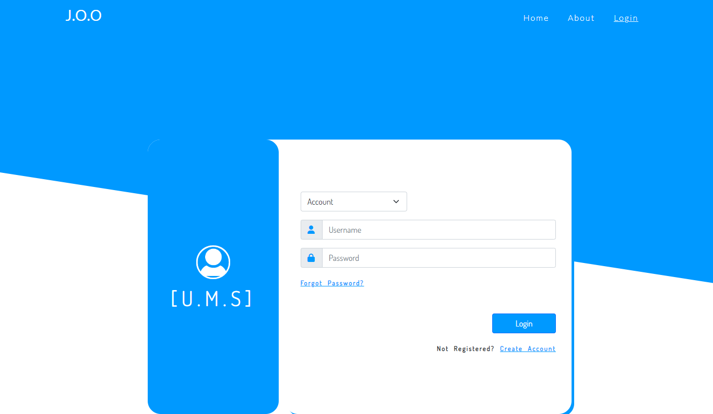
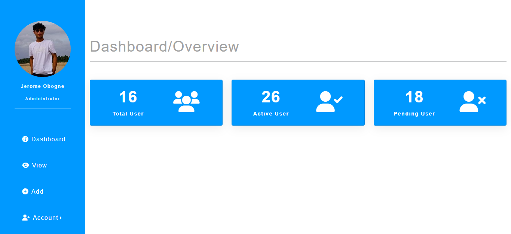
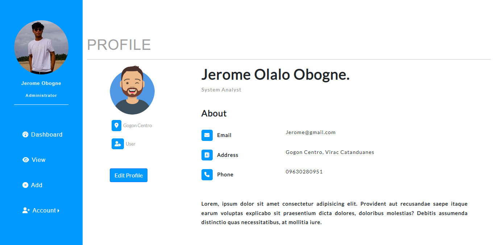
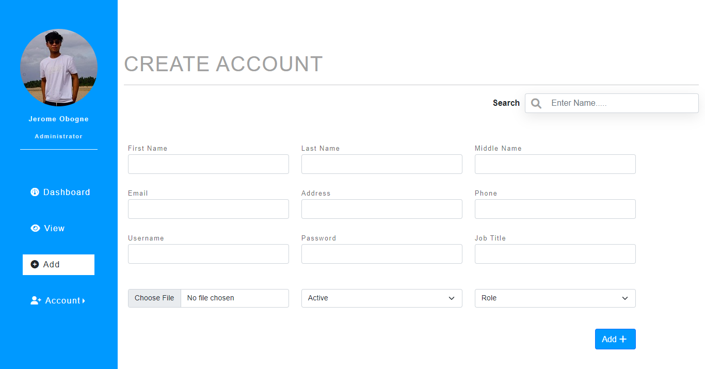
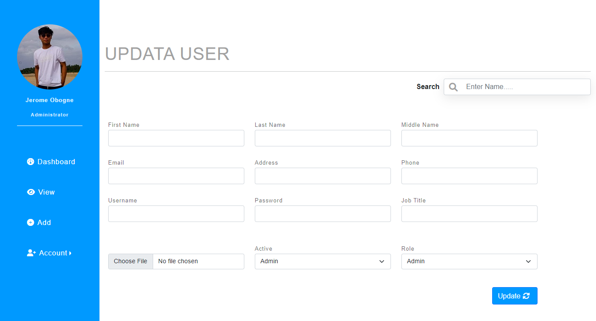
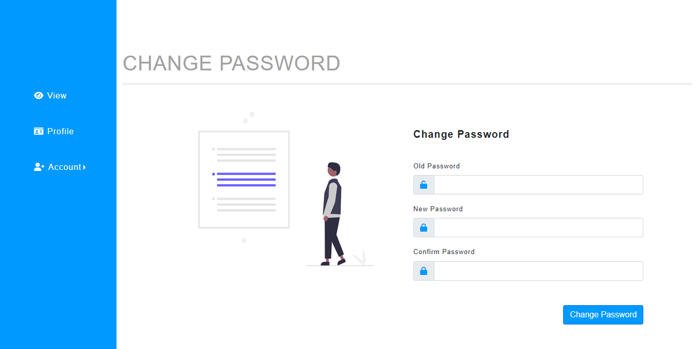
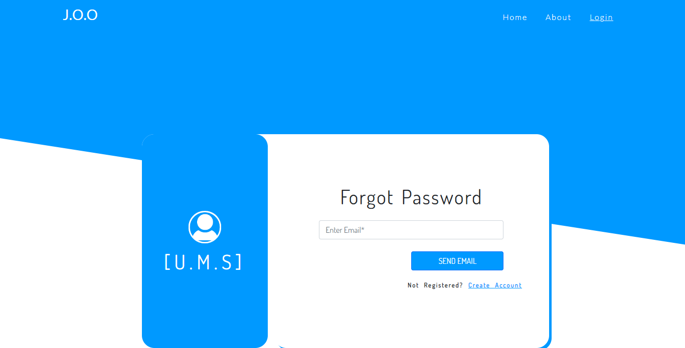
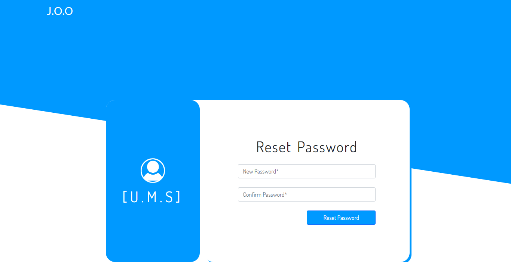

# User-Management-System
## Description 
**User Management System**  that focuses on managing employee data and keeping track the account information.
It has a feature to create, read, update, delete, and upload profiles of employees.

## User Interface Demo

## Features of System

### &nbsp;&nbsp; Admin  

 * Add Account
 * Change Password
 * Update Profile & Upload Photo
 * Delete Account
 * Create Users & Assign Roles

 

 ### &nbsp;&nbsp; Users

* View Account
* Update Account
* Register Account
* Change Password
* Forgot Password

## Technology Used

* HTML
* CSS
* JS
* BOOTSTRAP 5
* JAVA
    * Jsp
    * Servlet

## Databases
* MYSQL

## Tools
* Git
* AWS (S3,RDS,EC2)

